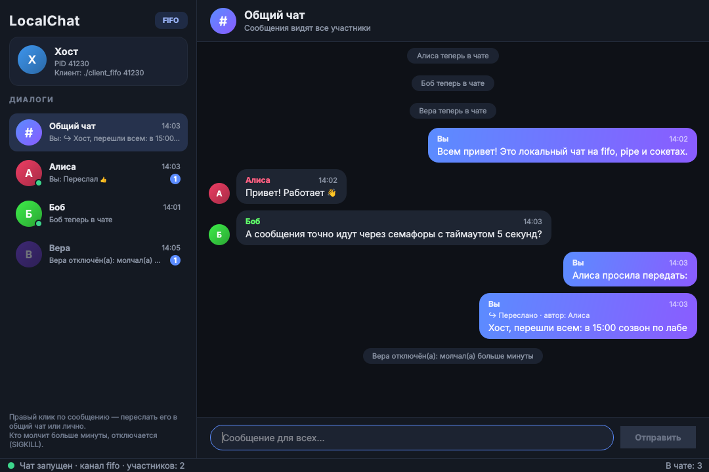
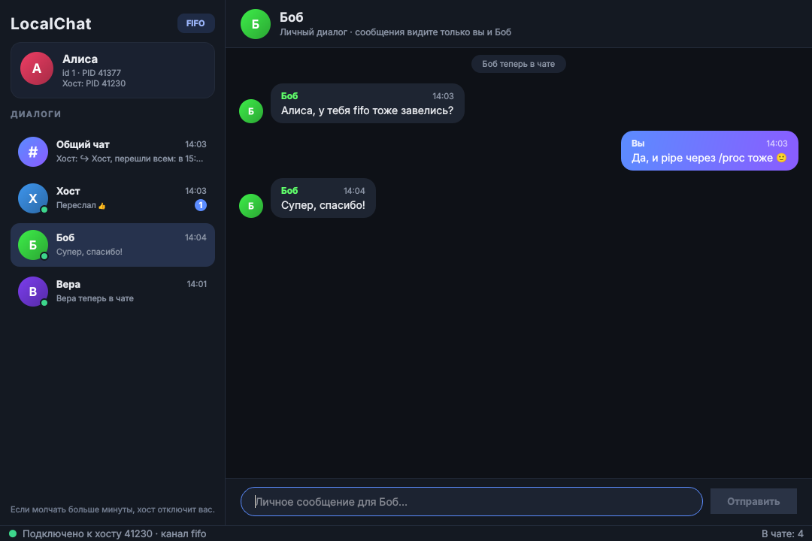

# Лабораторная работа 2. Локальный чат (вариант 20)

Сценарий 2 «Локальный сетевой чат», конфигурация «Независимые, один ко многим»,
типы взаимодействия: программные каналы (pipe), именованные каналы (mkfifo), сокеты (socket).

Хост и клиенты - отдельные программы с графическим интерфейсом на Qt 6, устроенным как
мессенджер: слева диалоги («Общий чат» и личный диалог с каждым участником), справа лента
выбранного диалога. У каждого диалога своя история, в списке видно последнее сообщение,
время и число непрочитанных; вышедшие участники остаются серыми, с историей.

* Все сообщения идут через хост: общие он рассылает всем, личные - только отправителю и адресату.
* Хост сам пишет в общий чат и лично, а ещё **пересылает** чужие сообщения: правый клик по
  сообщению → «Переслать в общий чат» или «Переслать лично». У пересланного сообщения видно автора.
* Клиент, который молчит больше минуты, получает SIGKILL.
* Сообщения в каждом диалоге упорядочены по времени отправки.



## Сборка

```bash
make            # то же, что ./build.sh
```

Для каждого файла `src/common/transport/conn_<тип>.cpp` собираются `host_<тип>` и `client_<тип>`:
`host_fifo`, `client_fifo`, `host_sock`, `client_sock`, `host_pipe`, `client_pipe`.
Бинарники кладутся в корень проекта, промежуточные файлы CMake удаляются.

Qt ищется в `~/Qt/6.10.2/gcc_64` (установщик Qt), другой путь задаётся переменной `QT_DIR`:

```bash
QT_DIR=~/Qt/6.9.0/gcc_64 make
```

Если окно не открывается с ошибкой про плагин `xcb`: `sudo apt install libxcb-cursor0`.

## Запуск

```bash
./host_fifo                        # окно хоста показывает его PID
./client_fifo <PID хоста> Алиса    # имя можно не указывать — спросит при запуске
./client_fifo <PID хоста> Боб
```

Хост и клиенты должны использовать один тип канала (`host_sock` + `client_sock` и т. д.).
Слева список диалогов: «Общий чат» - сообщение всем, участник - личное сообщение.
Закрыть можно окном, Ctrl+C или `kill`: хост в любом случае удалит свои FIFO, сокеты и семафоры.

Журнал работы пишется в stderr: подключения, выходы, ошибки, отключения за молчание.

## Тесты

```bash
./run_tests.sh               # всё в Docker, система не засоряется
./run_tests.sh -L unit       # только unit
./run_tests.sh -R fifo       # только транспорт fifo
```

Без Docker:

```bash
cmake -S . -B build -DBUILD_GUI=OFF && cmake --build build && ctest --test-dir build
```

| Набор | Что проверяет |
|---|---|
| `unit_tests` | `UniqueFd`, сигналы, именованный семафор, формат сообщения |
| `conn_tests_<тип>` | один и тот же контракт `Conn` для fifo, sock и pipe: порядок, границы сообщений, таймауты, обнаружение закрытия, уборка файлов |
| `chat_tests_<тип>` | весь чат без GUI: хост в процессе теста, каждый клиент - отдельный процесс (`fork`); знакомство, общие и личные сообщения, пересылка хостом, выход, SIGKILL за молчание |

## Как это устроено

### Знакомство (двустороннее, сигналами)

```
клиент: блокирует SIGUSR1 → SIGUSR1 хосту → ждёт ответ (sigtimedwait, ≤ 5 с)
хост:   поток знакомства берёт SIGUSR1 (sigtimedwait), pid клиента - из siginfo.si_pid
        → создаёт канал с id клиента → отвечает SIGUSR1 со значением id (sigqueue)
клиент: по id открывает свой канал и шлёт Hello с именем
```

Обычные сигналы от двух клиентов одновременно склеиваются в один, поэтому клиент,
не дождавшийся ответа за 5 секунд, стучится повторно (до трёх раз).

### Каналы: `conn_fifo.cpp`, `conn_sock.cpp`, `conn_pipe.cpp`

Все три реализуют один класс `Conn` (`transport/conn.hpp`); какой из них попадёт в программу,
решает линковка: `host_fifo` = `host.cpp` + `conn_fifo.cpp`.

| Тип | Как устроен канал клиента с id N |
|---|---|
| fifo | два FIFO: `/tmp/chat-<pid хоста>-N-up.fifo` (клиент → хост) и `…-down.fifo` (хост → клиент) |
| sock | Unix-сокет `/tmp/chat-<pid хоста>-N-sock`, хост слушает, клиент подключается |
| pipe | два `pipe2` в хосте, перенесённые на номера дескрипторов, вычисляемые из N; клиент открывает их как `/proc/<pid хоста>/fd/<номер>` |

### Синхронизация

У каждого канала два глобальных семафора (`sem_open`): `/chat-<pid>-N-up` и `/chat-<pid>-N-down`.
Писатель после каждого сообщения делает `sem_post`, читатель перед чтением - `sem_timedwait`.
Ожидание семафора и ответа на знакомство ограничено 5 секундами; по истечении связь
разрывается, клиент показывает «Нет связи с хостом» и перестаёт работать.
Ожидание сообщений от пользователя не ограничено - это запланированное ожидание.

### Хост

* поток знакомства - принимает новых клиентов;
* по потоку на каждого клиента - читает его сообщения и передаёт в маршрутизацию;
* сторожевой поток - раз в 250 мс проверяет, кто молчит больше минуты, и шлёт ему SIGKILL.

Маршрутизация идёт под одним мьютексом, поэтому все участники получают сообщения в одном
порядке. Хост - участник с id 0; поле `from` хост всегда проставляет сам, клиент не может
выдать себя за другого.

Пересылка (`Hub::forward`): хост отправляет копию сообщения от своего имени в общий чат или
одному участнику, а в поле `forwardedFrom` указывает автора оригинала. Клиент это поле
заполнить не может - хост его сбрасывает.

Формат сообщения: `type(1) from(4) to(4) sentAt(8) forwardedFrom(4) textSize(4) text`,
типы `Hello`, `Chat`, `Joined`, `Left`.

### Интерфейс

Логика (`host/model`, `client/model`) не зависит от Qt. Окно (`common/ui/ChatWindow`) общее
для хоста и клиента; `host/view` и `client/view` связывают их. У каждого диалога своя модель
(`MessageModel`), список диалогов и пузыри рисуют `DialogDelegate` и `MessageDelegate`.


 События из потоков логики
передаются в поток GUI через `QMetaObject::invokeMethod(..., Qt::QueuedConnection)`.

SIGINT, SIGTERM и SIGHUP заблокированы и читаются через `signalfd` в цикле событий Qt:
приложение завершается штатно, деструкторы убирают файлы и семафоры. SIGPIPE игнорируется,
запись в закрытый канал возвращает ошибку `EPIPE`.

## Структура

```
src/
├── common/
│   ├── posix/      UniqueFd, сигналы, именованный семафор, ввод-вывод, журнал
│   ├── proto/      Message: типы, кодирование, константы
│   ├── transport/  Conn и его реализации conn_fifo / conn_sock / conn_pipe
│   └── ui/         окно чата, диалоги, модель и отрисовка сообщений, тема
├── host/
│   ├── model/      Hub, Participant, HandshakeListener
│   ├── view/       HostWindow
│   └── host.cpp    main хоста
└── client/
    ├── model/      ClientSession, knock (знакомство)
    ├── view/       ClientWindow
    └── client.cpp  main клиента
tests/
├── ut/             unit-тесты и тесты Conn
├── ct/             тесты всего чата через fork
└── Dockerfile
```

## Требования задания

| Требование | Где |
|---|---|
| main хоста в `host.cpp`, клиента в `client.cpp` | `src/host/host.cpp`, `src/client/client.cpp` |
| типы взаимодействия в `conn_*`, один интерфейс | `src/common/transport/conn.hpp` + `conn_*.cpp` |
| любой `*.cpp` собирается без правки CMakeLists | `file(GLOB … CONFIGURE_DEPENDS)` в каждом модуле |
| `host_*`/`client_*` для каждого `conn_*` | цикл в `src/common/transport/CMakeLists.txt` и `src/CMakeLists.txt` |
| `make` собирает всё, `build.sh` чистит за cmake | `Makefile`, `build.sh` |
| `-Wall -Werror` | `CHAT_WARNINGS` (плюс `-Wextra`) |
| двустороннее знакомство сигналом | `client/model/handshake.cpp`, `host/model/handshake_listener.cpp` |
| глобальные семафоры, таймауты 5 с | `common/transport/channel.cpp`, `common/posix/named_semaphore.cpp` |
| хост пишет сам, пересылает чужие сообщения в общий чат и лично | `Hub::sendFromHost`, `Hub::forward`; в окне - правый клик по сообщению |
| общие видят все, личные - отправитель и адресат | `Hub::route` |
| поток на клиента | `Hub::acceptClient` / `Hub::readLoop` |
| SIGKILL за минуту молчания | `Hub::watchdogLoop` |
| статусы в GUI, лог ошибок | `addStatus` в окнах, `common/posix/log.cpp` |

## Ограничения

* Через pipe хост держит четыре дескриптора на клиента начиная с номера 400; лимит
  дескрипторов при необходимости поднимается до жёсткого предела процесса.
* Если хост убить через SIGKILL, его файлы в `/tmp/chat-<pid>-*` и семафоры
  `/dev/shm/sem.chat-<pid>-*` останутся; имена содержат pid, новым запускам они не мешают.
